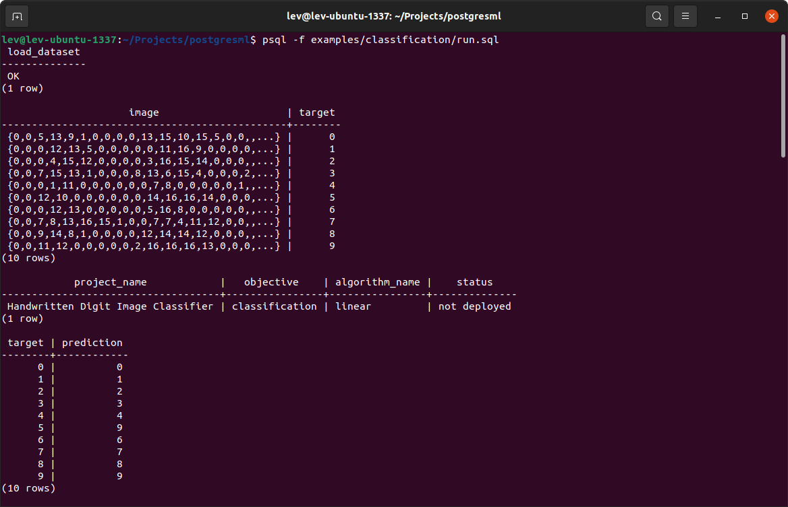
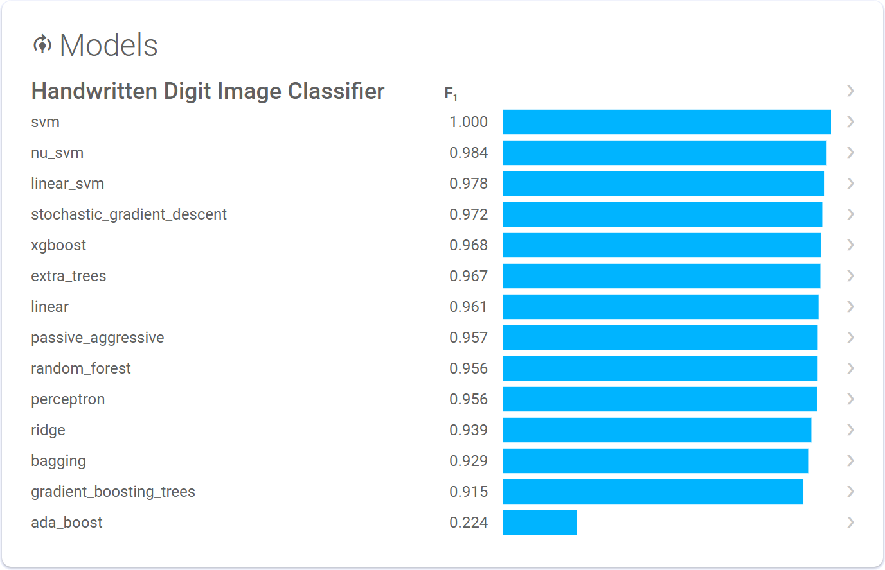

<p align="center">
  <a href="https://postgresml.org/">
    
  </a>
</p>
  
<h2 align="center">
  <a href="https://postgresml.org/">
    <svg version="1.1"
        xmlns="http://www.w3.org/2000/svg"
        xmlns:xlink="http://www.w3.org/1999/xlink"
        width="200" height="50"
    >
        <text font-size="32" x="20" y="32">
            <tspan fill="white" style="mix-blend-mode: difference;">Postgres</tspan><tspan fill="dodgerblue">ML</tspan>
        </text>
    </svg>
  </a>
</h2>

<p align="center">
    Simple machine learning with 
    <a href="https://www.postgresql.org/" target="_blank">PostgreSQL</a>
</p>

<p align="center">
    <a href="https://circleci.com/gh/postgresml/postgresml/tree/master"></a>
    <a href="https://pypistats.org/packages/pgml-extension"></a>
    <a href="https://pypi.org/project/pgml-extension"></a>
</p>

<p align="center">
    Train and deploy models to make online predictions using only SQL, with an open source extension for Postgres. Manage your projects and visualize datasets using the built in dashboard.
</p>



The dashboard makes it easy to compare different algorithms or hyperparaters across models and datasets.

[](https://demo.postgresml.org/)

<h2 align="center">
    See it in action — <a href="https://demo.postgresml.org/" target="_blank">demo.postgresml.org</a>
</h2>

## What's in the box
See the documentation for a complete **[list of functionality](https://postgresml.org/)**.

### All your favorite algorithms
Whether you need a simple linear regression, or extreme gradient boosting, we've included support for all classification and regression algorithms in [Scikit Learn](https://scikit-learn.org/) and [XGBoost](https://xgboost.readthedocs.io/) with no extra configuration.

### Managed model deployements
Models can be periodically retrained and automatically promoted to production depending on their key metric. Rollback capability is provided to ensure that you're always able to serve the highest quality predictions, along with historical logs of all deployments for long term study.

### Online and offline support
Predictions are served via a standard Postgres connection to ensure that your core apps can always access both your data and your models in real time. Pure SQL workflows also enable batch predictions to cache results in native Postgres tables for lookup.

### Instant visualizations
Run standard analysis on your datasets to detect outliers, bimodal distributions, feature correlation, and other common data visualizations on your datasets. Everything is cataloged in the dashboard for easy reference.

### Hyperparameter search
Use either grid or random searches with cross validation on your training set to discover the most important knobs to tweak on your favorite algorithm.

### SQL native vector operations
Vector operations make working with learned emebeddings a snap, for things like nearest neighbor searches or other similarity comparisons.

### The performance of Postgres
Since your data never leaves the database, you retain the speed, reliability and security you expect in your foundational stateful services. Leverage your existing infrastructure and expertise to deliver new capabilities.

### Open source
We're building on the shoulders of giants. These machine learning libraries and Postgres have recieved extensive academic and industry use, and we'll continue their tradition to build with the community. Licensed under MIT.

## Quick Start

1) Clone this repo:

```bash
$ git clone git@github.com:postgresml/postgresml.git
```

2) Start dockerized services. PostgresML will run on port 5433, just in case you already have Postgres running:

```bash
$ cd postgresml && docker-compose up
```

3) Connect to PostgreSQL in the Docker container with PostgresML installed:

```bash
$ psql postgres://postgres@localhost:5433/pgml_development
```

4) Validate your installation:

```sql
pgml_development=# SELECT pgml.version();
 
 version
---------
 0.8.1
(1 row)
```

See the documentation for a complete guide to **[working with PostgresML](https://postgresml.org/)**.
